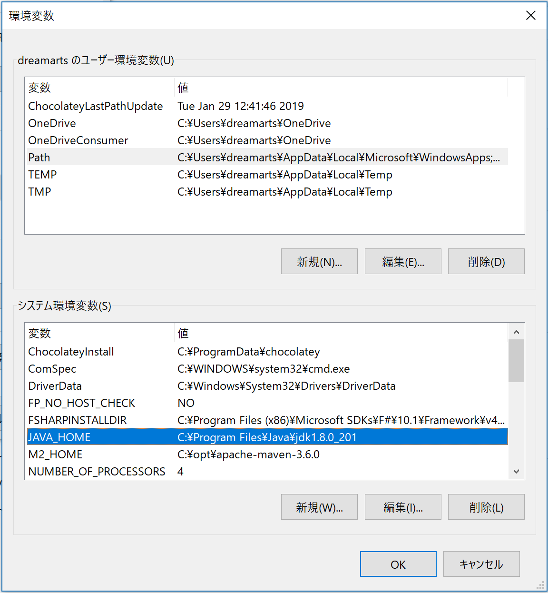
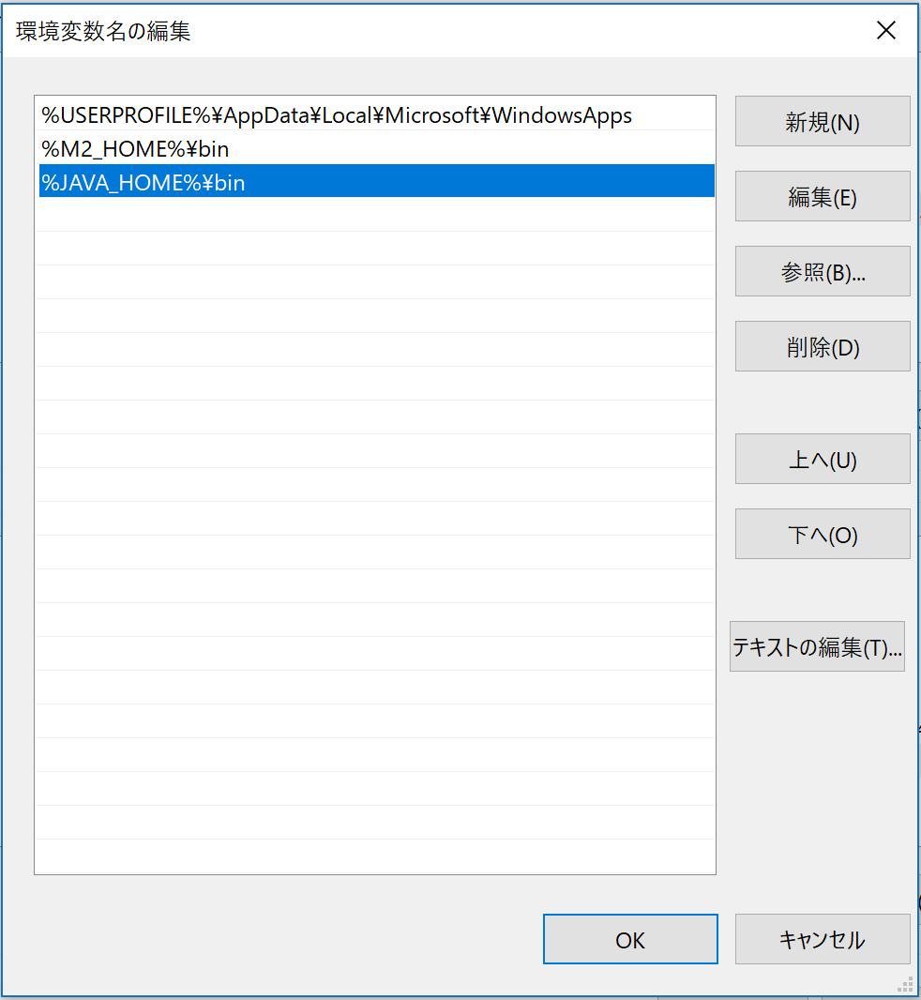

# 事前の環境セットアップ
JHipsterを動かすために以下のものがローカルに必要なので事前にセットアップして来てもらえるとスムーズです。
 - JDK 8u201
 - Maven
 - git
 - node 10.15.0

またJava IDEとして、Eclipse / IntelliJ / VCCode などがあると作業をすすめやすいです。
説明自体は、EclipseとVSCodeで行います。

## Macの場合
### JDK 8u201
 - Oracleのサイト (https://www.oracle.com/technetwork/es/java/javase/downloads/jdk8-downloads-2133151.html) から jdk-8u201-macosx-x64.dmg をダウンロードしてインストールする

### Maven
 - homebrew でインストールする (homebrew 自体のインストールは https://brew.sh/index_ja)
```
brew install maven
```

### git
```
brew install git
```

### node
 - JHipsterがLTS版を要求するので、10.15.0 を利用可能なようにセットアップする。
 - 複数のバージョンを切り替えられるように nodebrew を用いるのがおすすめ。

 - nodebrew のインストール
```
curl -L git.io/nodebrew | perl - setup
```

```~/.bash_profile_```に以下の行を追加
```
export PATH=$HOME/.nodebrew/current/bin:$PATH
```

 - node 10.15.0 のインストール
```
nodebrew install v10.15.0
nodebrew use v10.15.0
node -v
v10.15.0
```

 - 残念なことに nodebrew を使わずに node をインストールしてしまった場合は、以下の手順でアンインストールして nodebrew を改めてインストールした方がいい。
 ```
$ curl -o uninstall-node.sh https://gist.githubusercontent.com/nicerobot/2697848/raw/uninstall-node.sh
$ chmod u+x uninstall-node.sh 
$ ./uninstall-node.sh 
$ rm uninstall-node.sh
$ sudo rm -rf /usr/local/include/node
$ sudo rm -rf /usr/local/lib/dtrace
$ rm -rf ~/.node-gyp
$ rm -rf ~/.npm
$ rm -rf ~/.sourcemint 
```

 - npm を更新
```
npm install -g npm
```

## Windowsの場合
### JDK8u201
 - システムの詳細設定 > 環境変数 を開き、システム環境変数として ```JAVA_HOME``` 値は、```C:\Program Files\Java\jdk1.8.0_201``` を設定



### Maven
 - バイナリ配布パッケージをダウンロードして任意のディレクトリに展開
 - システムの詳細設定 > 環境変数 で、```M2_HOME``` をインストールした先のディレクトリ名で作成。

 - Path に、```%JAVA_HOME%¥bin``` と ```%M2_HOME%¥bin``` を追加する



### git
 - https://git-scm.com/download/win からインストーラーをダウンロードしてインストール
 - インストールタイプとして、Git from the command line and also from 3rd-party software を選択

### node
 - nvm-install (https://github.com/coreybutler/nvm-windows/releases) でインストールするのをオススメ 
 - PowerShell を管理者モードで起動して
```
> nvm install 10.15.0
> nvm use 10.15.0
```

 - npm の更新のために npm-windows-upgrade をインストール
```
> Set-ExecutionPolicy Unrestricted -Scope CurrentUser -Force
> npm install -g --production npm-windows-upgrade
> npm-windows-upgrade
```
