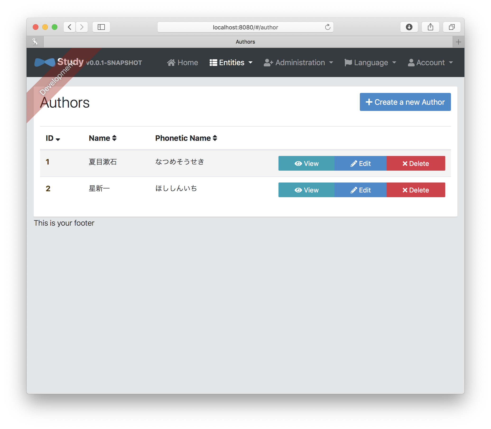

# JDLによるモデル層の設計

JDL == JHipster Domain Language

データベースの定義、DTO

## JDL Studio
https://start.jhipster.tech/jdl-studio/ で、UMLライクなDR図を見ながら作成することができる。

## サンプル

本と著者のデータベースを作ってみた。

```
entity Book {
	isbn String
    title String
    price Integer
    language Language
    publishDate Instant
}

entity Author {
	name String
    phoneticName String
}

enum Language {
    ENGLISH, JAPANESE
}

relationship ManyToOne {
	Book{author(name)} to Author
}

paginate Book with pagination
paginate Author with infinite-scroll
```

著者は複数の本を出版するというモデル。

## JDLをベースにしたソースコードの自動生成

```
jhipster import-jdl {path/to/jdl-file.jh}
```
以下のものが自動生成される
- JPAのためのBean
- SpringによるAPIの実装
- データベース

## 確認してみる

単純にエンティティを操作するUIが自動生成される。



この画面はAngularで作られており、


